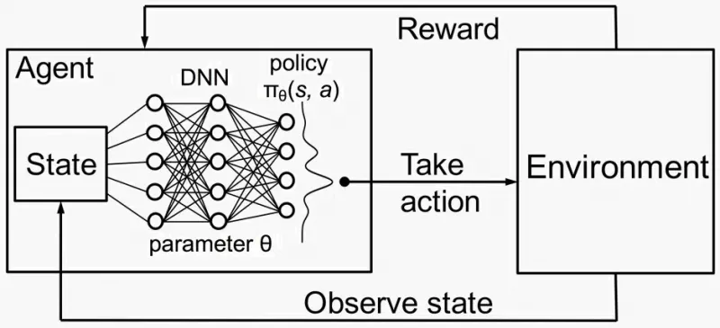
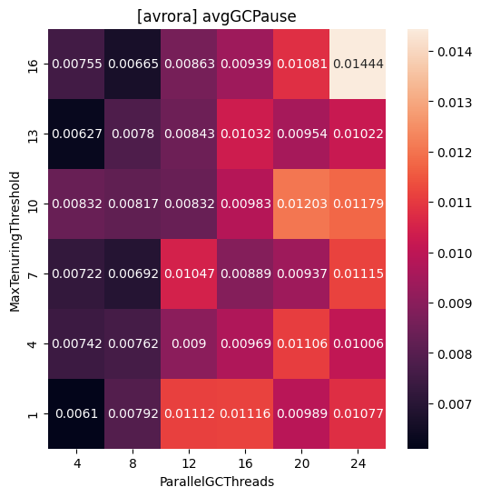
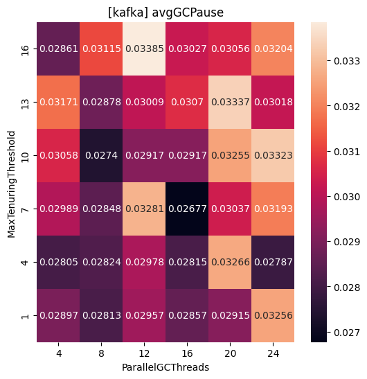

# Performance Tuning using Reinforcement Learning
The goal of this research is to develop an approach that can automatically tune JVM settings in response to the environment dynamics to achieve better performance. The key idea of the system is to use reinforcement learning (RL) techniques (Deep Q-Network) to automate performance configuration tuning on a given benchmark. 

We can formulate the task of performance tuning as a RL problem in which the optimal policy refers to generate a configuration for higher performance. Each configuration (JVM options) represents a RL state. When performance tuning occurs (i.e., issue an action to change configuration), an action receives a reward based on performance measurements. Given sufficient interactions with the environment, RL obtains an estimation of how good an action is for the current configuration (i.e. state).
## 1. Installation

### Requirements
- OpenJDK 11
- DaCapo benchmark
- gcviewer
- python3.8 <
- tensorflow==2.13.0
- tf-agents==0.17.0
Please see the additional requirements in the file: [requirements.txt](requirements.txt).

### Step-by-step installation

Download the DaCapo benchmark & gcviewer jars using command line or just simply click on the following links and manually move downloaded files into the project directory.
```
cd gc-ml/
wget -O dacapo-bench.jar https://downloads.sourceforge.net/project/dacapobench/9.12-bach-MR1/dacapo-9.12-MR1-bach.jar
wget -O gcviewer-1.36.jar http://sourceforge.net/projects/gcviewer/files/gcviewer-1.36.jar/download
```

Then download the OpenJDK 11 build from [BellSoft website](https://bell-sw.com/pages/downloads/#jdk-11-lts) (optionally). You can use any Java build you want.
```
# NOTE: This link is for Linux
wget -O jdk.tar.gz https://download.bell-sw.com/java/11.0.20+8/bellsoft-jdk11.0.20+8-linux-amd64.tar.gz
```

Unpack `jdk.tar.gz` and remove the archive.
```
tar xzf jdk.tar.gz && rm -fv jdk.tar.gz
cd jdk-11.0.20.8 & java -version
```

## 2. Prepare a dataset

### Synthetic Data
If you don't want to run DaCapo benchmarks while RL, pelase use synthethic data files that imitate [avrora](avrora_synthetic_saved_states.csv) and [kafka](kafka_synthetic_saved_states.csv) becnhmarks results.

### Real Data (optional)
**NOTE**: JVMEnv can be used with both offline synthetic data and online benchmark runs. **You do not need to collect real data by yourself to run RL with JVMEnv**. 

The following steps describe how to run a DaCapo benchmark, get Garbage Collector logs, process them using GCViewer and use this data in a Python script. 

In case you want to run the benchmarks and visualize the data, follow these steps.

1. Run DaCapo benchmarks on your machine using downloaded JDK and dacapo-bench.jar. 
[run_dacapo.sh](scripts/run_dacapo.sh)
```
# Training data (avrora becnhmark)
bash scripts/run_dacapo.sh jdk-11.0.20.8 dacapo-bench.jar callback gc-logs avrora

# Evaluation data (kafka becnhmark)
bash scripts/run_dacapo.sh jdk-11.0.20.8 dacapo-bench.jar callback gc-logs kafka
```
2. Preprocess collected GC logs stored in `gc-logs` directory using downloaded GCViewer jar file.
[get_summary.sh](scripts/get_summary.sh)
```
# Training data (avrora becnhmark)
bash scripts/get_summary.sh jdk-11.0.20.8 gcviewer-1.36.jar avrora

# Evaluation data (kafka becnhmark)
bash scripts/get_summary.sh jdk-11.0.20.8 gcviewer-1.36.jar kafka
```
3. Parse files stored in `summaries_avrora` and `summaries_kafka` directories using `get_data_from_csv()` method from [utils](utils/dataset_util.py).
```
# Example from dataset_util.ipynb
target_goal = "avgGCPause"
x, y, z = get_data_from_csv(
    csv_dir= "summaries_avrora", 
    goal = target_goal)
```
## 3. Usage
The main code is stored in [main_dqn.ipynb](main_dqn.ipynb).

## 4. Description
### 4.1 Environment
- Java Benchmark (DaCapo benchmark, e.g. Avrora/Kafka) with specific JVM arguments.
- `action_spec`:  we have 2 actions for each JVM argument.
    
    Table 1. **RL Actions**
    
    | Num | Action |
    | --- | --- |
    | A1 | Decrease MaxTenuringThreshold by 3 |
    | A2 | Increase MaxTenuringThreshold by 3 |
    | A3 | Decrease ParallelGCThreads by 4 |
    | A4 | Increase ParallelGCThreads by 4 |
- `observation_spec`: Current JVM argument values.
    
    Table 2. **Configuration Options**
    
    | Name | Type | Range | Constraints |
    | --- | --- | --- | --- |
    | MaxTenuringThreshold | Int | [1, 16] | - |
    | ParallelGCThreads | Int | [4, 24] | - |
- `reward`: A reward is calculated based on performance measuremennt, for example, average GC pause. The objective is to find the smallest goal value (average GC pause). We can achieve this by using the following reward at the end of the training iteration:
    
    $$
    reward(c,d) = \begin {cases}-1, \text{ if c > d},  \\-(c - d) / c\end{cases}
    $$
    
    where `c` is current goal value, and `d` is default goal value. We first obtain the performance measurement under the current configuration options. The reward is the relative difference between the current goal value and the default one, the normalization puts a large measurement range on the same scale.
    
- `state` : A state is encoded as an instance of the subject program’s configurations (JVM arguments). The default JVM arguments are used as the initial states.

### 4.2 Agent

The algorithm used to solve an RL problem is a DQN agent. At the heart of a DQN Agent is a QNetwork, a neural network model that can learn to predict QValues (expected rewards) for all actions, given an observation from the environment.

The network is consist of a sequence of Dense layers, where the final layer has a single output for each possible action.



### 4.3 Data Collection & Experience Replay

In order to keep track of the data collected from the environment, we use a replay buffer. It stores experience data when we collect trajectories and is consumed during training. All of the actions and observations that the agent has taken from the beginning (limited by the capacity of the memory, of course) are stored. Then a batch of samples is randomly selected from this memory. This ensures that the batch is ‘shuffled’ and contains enough diversity from older and newer samples to allow the network to learn weights that generalize to all the scenarios that it will be required to handle.
Each row of the replay buffer only stores a single observation step. But since the DQN Agent needs both the current and next observation to compute the loss, the dataset pipeline will sample two adjacent rows for each item in the batch.

<p float="left">
  
   
</p>

### 4.4 Example

Table below shows a small example — the problem of perfomance tuning with RL using a DaCapo benchmark. It can be seen that each state is a combination of the current configuration option values. The default values of JVM arguments are used as the initial state (S1). The “Action” column lists the next actions to be performed on the JVM configuration. The “Reward” column lists the immediate performance reward. 

**Goal** — average GC pause.

**Default** {MaxTenuringThreshold, ParallelGCThreads} = {16, 16}.

**Default** {avgGCPause} =0.00939.

Table 3. **RL States**

| State | MaxTenuringThreshold | ParallelGCThreads | Goal | Action | Reward |
| --- | --- | --- | --- | --- | --- |
| S1 | 16 | 16 | 0.00939 | A1 | -1 |
| S2 | **13** | 16 | 0.01032 | A3 | 0.114 |
| S3 | 13 | **12** | 0.00843 | A2 | 0.088 |
| S4 | **16** | 12 | 0.00863 | … | … |

These rewards are used to compute the Target Q Value.